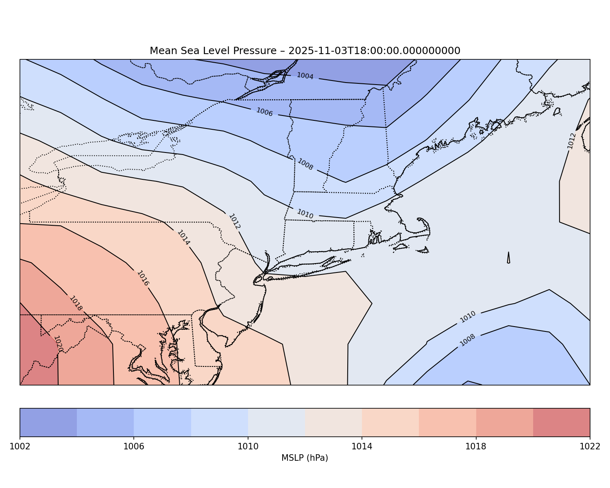

# (Jacks cookbook) Cookbook



[](https://github.com/ProjectPythia/cookbook-template/actions/workflows/nightly-build.yaml)
[](https://binder.projectpythia.org/v2/gh/ProjectPythia/cookbook-template/main?labpath=notebooks)
[](https://zenodo.org/badge/latestdoi/475509405)


This Project Pythia Cookbook covers ... (replace `...` with the main subject of your cookbook ... e.g., _working with radar data in Python_)

## Motivation

This notebook will show you how to plot 2-meter temperature and mean sea level pressure (MSLP) data on a map using Cartopy. It’s useful because you’ll learn how to work with weather data and make clear, professional-looking weather maps. By the end, you’ll know how to read data, plot it, and customize your own weather maps.

## Authors

[Jack Fordyce](https://github.com/DAES433533/jfordyce), 

## Structure

Getting Started with NOMADS Data: In this section, you’ll learn how to access and load weather data from the NOMADS server, including variables like 2-meter temperature and mean sea level pressure (MSLP). You’ll also set up the Python libraries needed for the analysis.

Plotting Weather Maps: This section walks you through visualizing the NOMADS data using Cartopy. You’ll create weather maps showing 2-meter temperature and MSLP, customize the map’s appearance, and learn the basics of weather data visualization in Python.

### Section 1 ( Getting Started with NOMADS Data)

In this section, you’ll learn how to access and load weather data from the NOMADS (NOAA Operational Model Archive and Distribution System) server. You’ll import the necessary Python libraries, open the dataset, and prepare variables like 2-meter temperature and mean sea level pressure (MSLP) for plotting. This section sets up everything you need before creating weather maps with Cartopy.

### Section 2 ( Plotting Weather Maps )

In this section, you’ll learn how to visualize the NOMADS data by plotting 2-meter temperature and mean sea level pressure (MSLP) on a map using Cartopy. You’ll go through the steps of setting up the map projection, adding features like coastlines and borders, and customizing your plots for a clean, professional look. By the end, you’ll know how to create your own weather maps to analyze different atmospheric patterns.

## Running the Notebooks

You can either run the notebook using [Binder](https://binder.projectpythia.org/) or on your local machine.

### Running on Binder

The simplest way to interact with a Jupyter Notebook is through
[Binder](https://binder.projectpythia.org/), which enables the execution of a
[Jupyter Book](https://jupyterbook.org) in the cloud. The details of how this works are not
important for now. All you need to know is how to launch a Pythia
Cookbooks chapter via Binder. Simply navigate your mouse to
the top right corner of the book chapter you are viewing and click
on the rocket ship icon, (see figure below), and be sure to select
“launch Binder”. After a moment you should be presented with a
notebook that you can interact with. I.e. you’ll be able to execute
and even change the example programs. You’ll see that the code cells
have no output at first, until you execute them by pressing
{kbd}`Shift`\+{kbd}`Enter`. Complete details on how to interact with
a live Jupyter notebook are described in [Getting Started with
Jupyter](https://foundations.projectpythia.org/foundations/getting-started-jupyter).

Note, not all Cookbook chapters are executable. If you do not see
the rocket ship icon, such as on this page, you are not viewing an
executable book chapter.


### Running on Your Own Machine

If you are interested in running this material locally on your computer, you will need to follow this workflow:

(Replace "cookbook-example" with the title of your cookbooks)

1. Clone the `https://github.com/ProjectPythia/cookbook-example` repository:

   ```bash
    git clone https://github.com/ProjectPythia/proto-cookbook.git
   ```

1. Move into the `proto-cookbook` directory
   ```bash
   cd cookbook-example
   ```
1. Create and activate your conda environment from the `environment.yml` file
   ```bash
   conda env create -f environment.yml
   conda activate proto-cookbook
   ```
1. Move into the `notebooks` directory and start up Jupyterlab
   ```bash
   cd notebooks/
   jupyter lab
   ```
